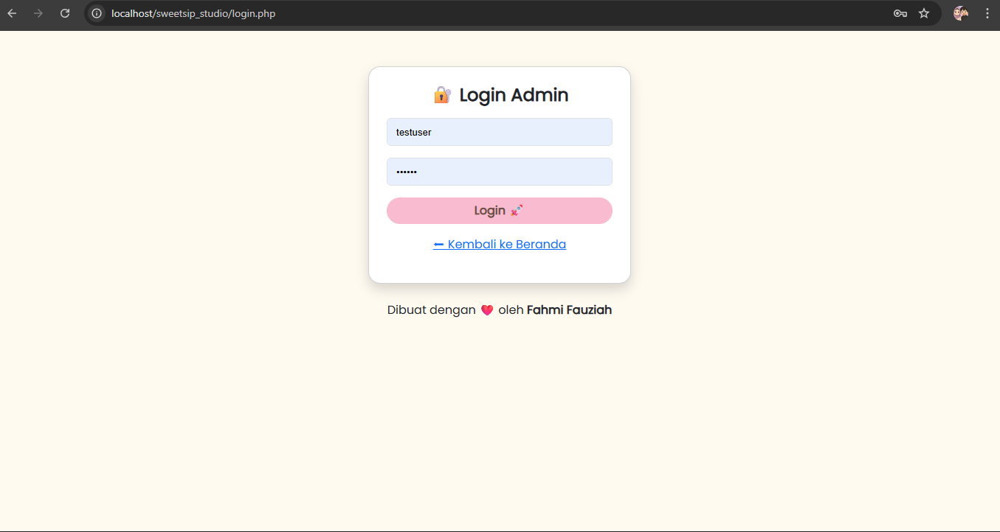
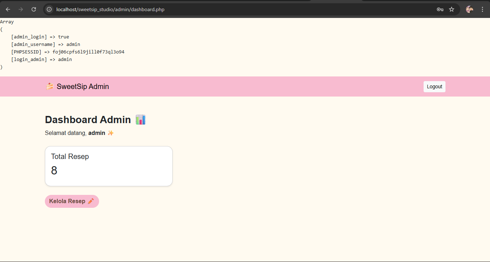
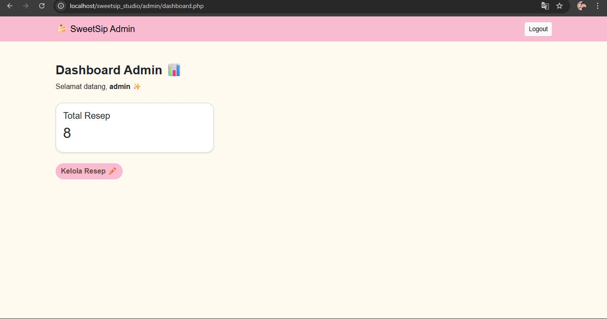
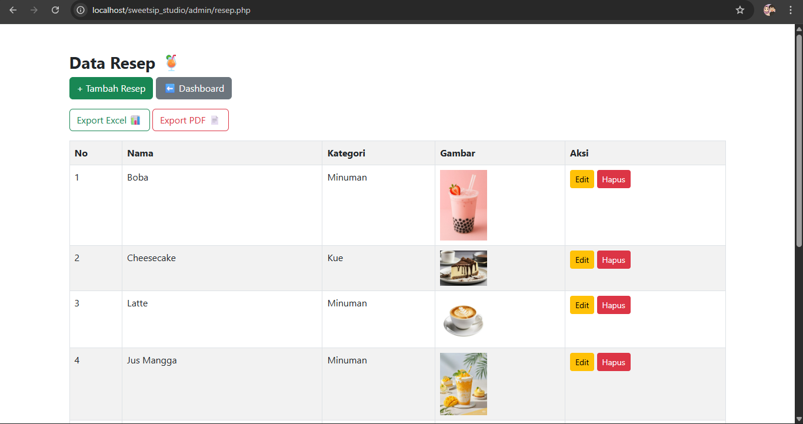
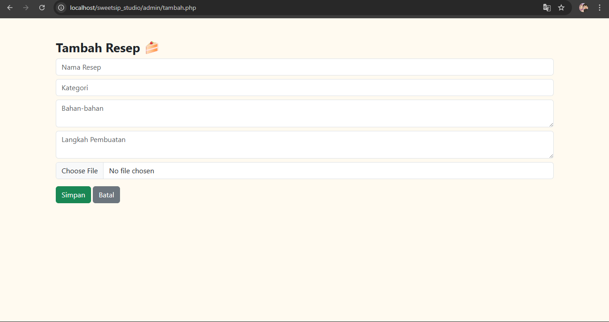
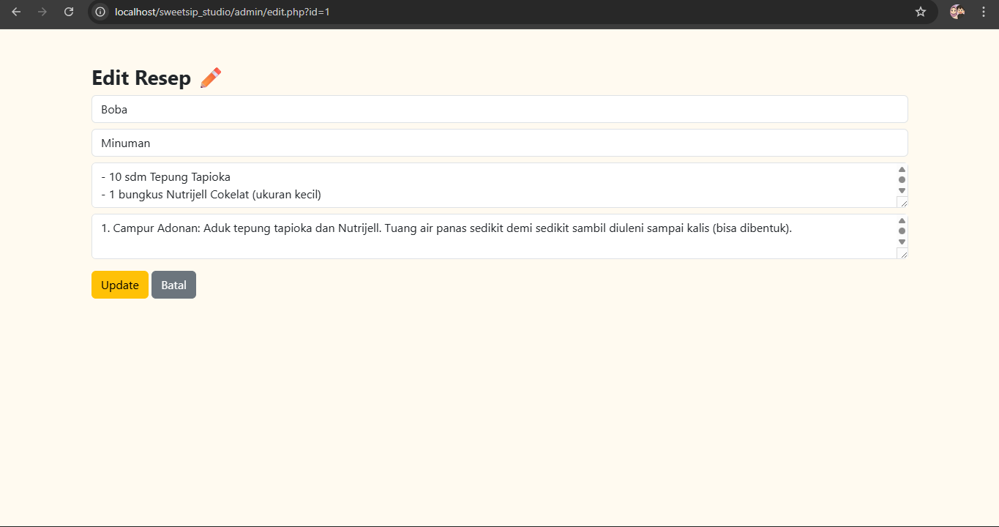
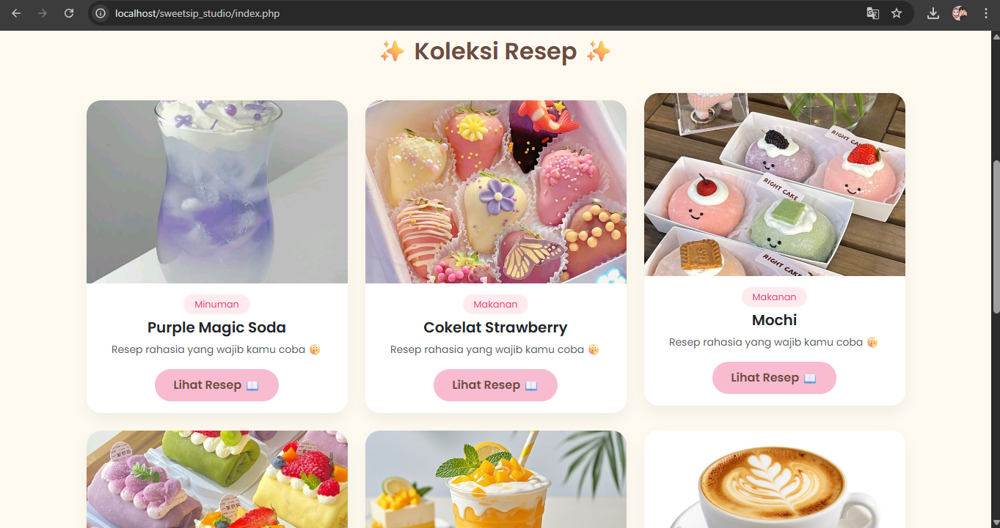

# SweetSip Studio – Dessert & Drinks Recipe

## Deskripsi Proyek

SweetSip Studio adalah aplikasi web berbasis PHP dan MySQL yang digunakan untuk menyimpan, mengelola, dan menampilkan resep makanan serta minuman manis. Aplikasi ini dirancang dengan tampilan aesthetic pastel agar nyaman digunakan, serta menyediakan fitur manajemen data resep yang terstruktur.

Proyek ini dikembangkan sebagai Proyek Ujian Akhir Semester (UAS) mata kuliah Web 1 dan dikerjakan secara individual.

---

## Studi Kasus

Sebagai seseorang yang menyukai makanan dan minuman manis, penulis sering menyimpan resep dari berbagai sumber seperti Instagram, TikTok, dan internet. Namun, resep-resep tersebut biasanya hanya disimpan dalam bentuk bookmark, tangkapan layar, atau catatan singkat yang lama-kelamaan menjadi tidak teratur, tertumpuk, bahkan hilang.

Permasalahan tersebut menyebabkan kesulitan dalam mencari kembali resep yang pernah disimpan dan mengelolanya secara rapi.

SweetSip Studio dibuat sebagai solusi untuk:
- Menyimpan resep makanan dan minuman manis secara terstruktur
- Mengelompokkan resep dalam satu sistem berbasis web
- Menampilkan resep dengan tampilan yang menarik dan mudah dibaca
- Memudahkan pengelolaan resep tanpa bergantung pada media sosial

Studi kasus ini relevan dengan kebiasaan pengguna sehari-hari dan sesuai dengan penerapan aplikasi web sederhana.

---

## Aktor dalam Sistem

### Admin
- Login ke sistem menggunakan autentikasi cookie
- Mengakses dashboard admin
- Mengelola data resep (Create, Read, Update, Delete)
- Mengekspor laporan data resep ke format PDF dan Excel

### Pengunjung
- Melihat daftar resep
- Membaca detail resep
- Tidak dapat mengubah atau mengelola data

---

## Alur Sistem Aplikasi

1. Admin melakukan login melalui halaman login
2. Sistem memvalidasi login menggunakan cookie
3. Jika login berhasil, admin diarahkan ke dashboard
4. Admin dapat menambah, mengubah, dan menghapus data resep
5. Data resep disimpan ke dalam database MySQL
6. Admin dapat mengekspor laporan resep ke format PDF dan Excel
7. Pengunjung dapat mengakses halaman frontend untuk melihat resep tanpa login

---

## Arsitektur Sistem

Frontend (HTML, CSS, Bootstrap)  
↓  
Backend (PHP)  
↓  
Database (MySQL)

Frontend berfungsi sebagai antarmuka pengguna, backend menangani logika aplikasi, autentikasi cookie, serta pengolahan data, dan database digunakan sebagai media penyimpanan data.

---

## Pemenuhan Ketentuan Proyek UAS

### Backend dan Frontend Terintegrasi
Aplikasi mengintegrasikan frontend dan backend dalam satu sistem berbasis web menggunakan PHP dan MySQL.

### Dashboard
Sistem menyediakan dashboard admin sebagai pusat pengelolaan dan informasi data resep.

### Laporan (PDF dan Excel)
Aplikasi menyediakan fitur export laporan data resep ke dalam format PDF dan Excel.

### CRUD
Fungsi Create, Read, Update, dan Delete diterapkan pada data resep.

### Autentikasi Cookie
Sistem autentikasi menggunakan cookie `login_admin`. Cookie dibuat saat login berhasil dan diverifikasi pada setiap halaman admin.

### Studi Kasus Nyata
Proyek dikembangkan berdasarkan kebiasaan nyata dalam menyimpan resep makanan dan minuman dari media sosial.

### Proyek Individual
Proyek dikerjakan secara mandiri dan bukan kerja kelompok.

---

## Tampilan Aplikasi (Screenshot)

### Halaman Login Admin
Menampilkan halaman login admin sebelum masuk ke sistem.

---

### Bukti Cookie Login
Menampilkan bukti autentikasi menggunakan cookie `login_admin` yang diverifikasi melalui variabel `$_COOKIE` pada halaman dashboard.

---

### Dashboard Admin
Dashboard admin sebagai pusat pengelolaan data resep.

---

### Kelola Data Resep (CRUD)
Halaman pengelolaan data resep yang mendukung tambah, edit, dan hapus data.

---

### Tambah Data Resep
Form untuk menambahkan data resep baru.

---

### Edit Data Resep
Form untuk mengubah data resep yang telah tersimpan.

---

### Export Laporan
Fitur export laporan data resep ke format PDF dan Excel.

---

### Halaman Frontend Pengunjung
Halaman frontend yang dapat diakses oleh pengunjung untuk melihat daftar dan detail resep.

---

## Teknologi yang Digunakan

- PHP
- MySQL
- HTML5
- CSS3
- Bootstrap

---

## Pengembang

Nama: Fahmi Fauziah  
Mata Kuliah: Web 1  
Jenis Proyek: Ujian Akhir Semester (UAS)
